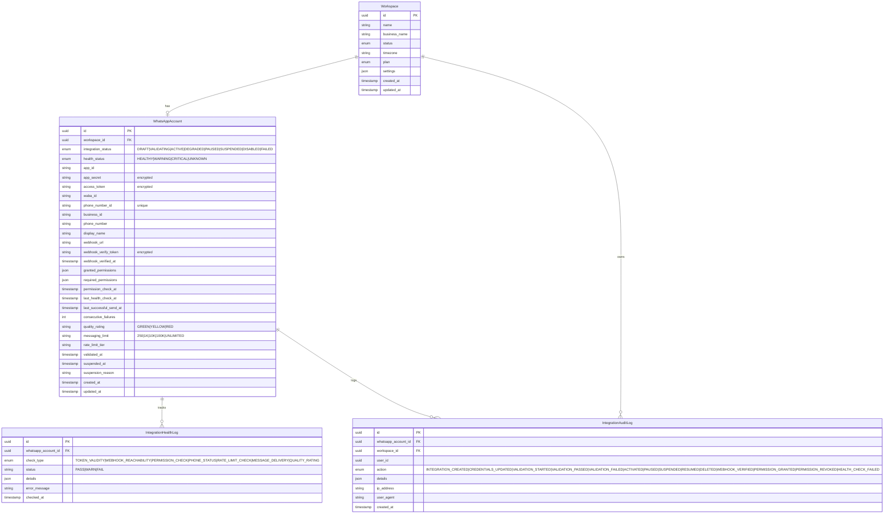
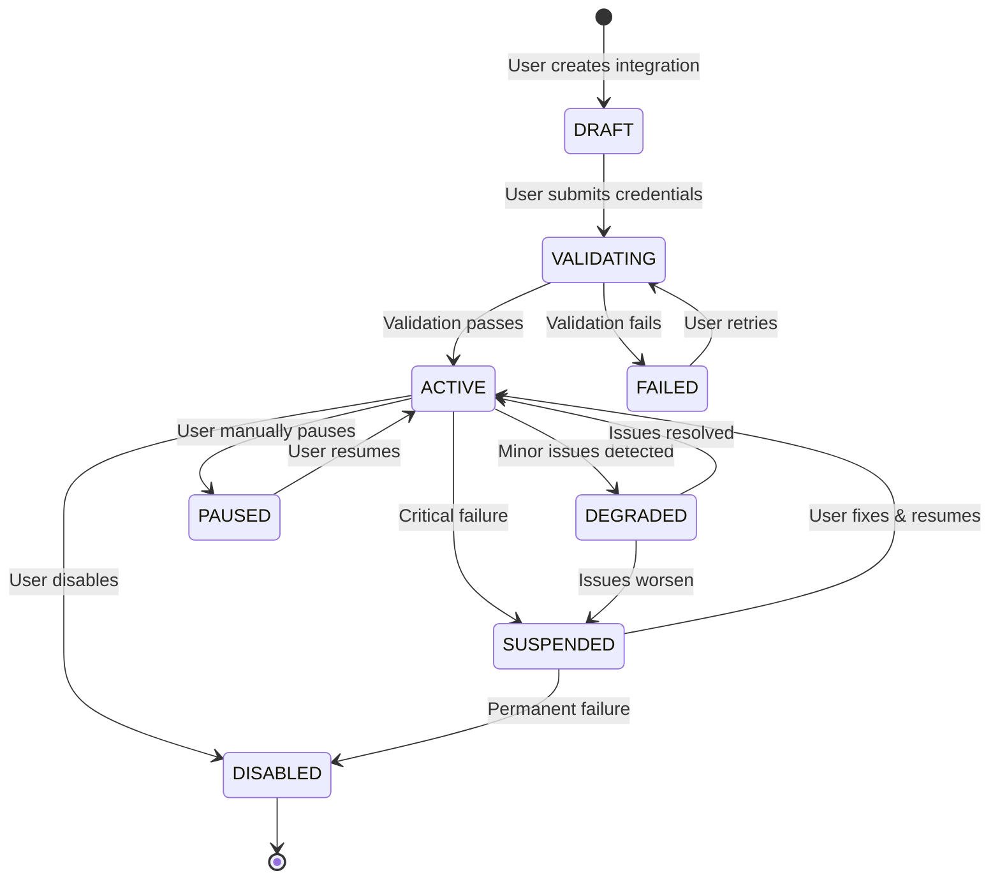
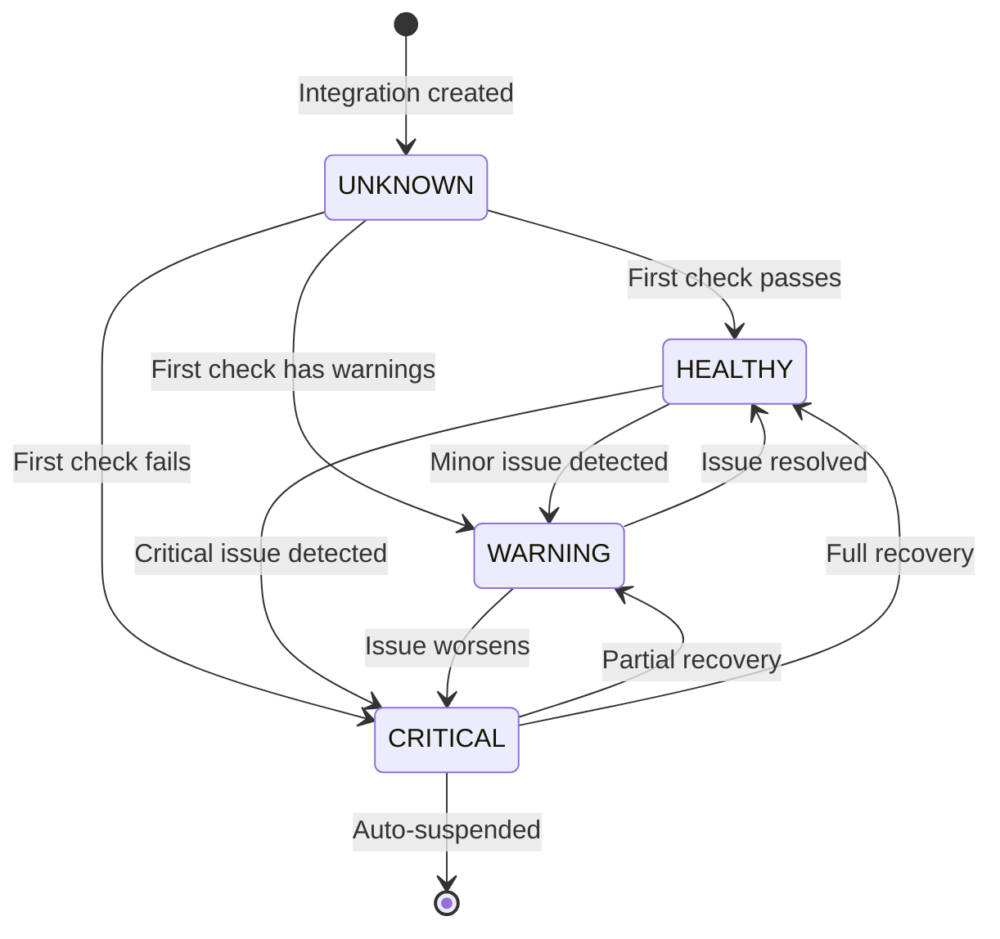

# WhatsApp Integration - Database Schema (ERD)

## 📊 Entity Relationship Diagram



---

## 📋 Table Descriptions

### WhatsAppAccount (Enhanced)

**Purpose**: Stores WhatsApp Business API integration credentials and status

**Key Changes from Current**:
- ✅ Added `integration_status` for lifecycle tracking
- ✅ Added `health_status` for real-time health
- ✅ Added `app_id` and `app_secret` for full Meta app credentials
- ✅ Added webhook configuration fields
- ✅ Added permission tracking
- ✅ Added health metrics (last check, consecutive failures)
- ✅ Added suspension tracking
- ✅ Encrypted sensitive fields (app_secret, access_token, webhook_verify_token)

**Indexes**:
- Primary: `id`
- Unique: `workspace_id` (one WABA per workspace)
- Unique: `phone_number_id`

---

### IntegrationHealthLog (New)

**Purpose**: Track all health check results over time

**Use Cases**:
- Historical health trends
- Debugging integration issues
- Compliance reporting
- Performance analytics

**Retention**: 90 days (configurable)

**Indexes**:
- Primary: `id`
- Composite: `(whatsapp_account_id, checked_at)` for time-series queries

---

### IntegrationAuditLog (New)

**Purpose**: Complete audit trail of all integration actions

**Use Cases**:
- Security compliance
- User action tracking
- Debugging who changed what
- Regulatory requirements

**Retention**: 1 year minimum (configurable)

**Indexes**:
- Primary: `id`
- Composite: `(whatsapp_account_id, created_at)` for account history
- Composite: `(workspace_id, created_at)` for workspace audit

---

## 🔄 Status Lifecycle Diagrams

### Integration Status Flow



### Health Status Flow



---

## 🔐 Encrypted Fields

### Fields Requiring Encryption

| Field | Type | Encryption Method | Display Method |
|-------|------|-------------------|----------------|
| `app_secret` | string | AES-256-GCM | `app_***************xyz` |
| `access_token` | string | AES-256-GCM | `EAA***************xyz` |
| `webhook_verify_token` | string | AES-256-GCM | `wvt_***************xyz` |

### Encryption Implementation

```typescript
// Prisma middleware approach
prisma.$use(async (params, next) => {
  if (params.model === 'WhatsAppAccount') {
    if (params.action === 'create' || params.action === 'update') {
      // Encrypt before save
      if (params.args.data.app_secret) {
        params.args.data.app_secret = await encrypt(params.args.data.app_secret);
      }
      if (params.args.data.access_token) {
        params.args.data.access_token = await encrypt(params.args.data.access_token);
      }
      if (params.args.data.webhook_verify_token) {
        params.args.data.webhook_verify_token = await encrypt(params.args.data.webhook_verify_token);
      }
    }
    
    const result = await next(params);
    
    if (params.action === 'findUnique' || params.action === 'findFirst' || params.action === 'findMany') {
      // Decrypt after read (only when needed)
      // This is handled in service layer, not middleware
    }
    
    return result;
  }
  return next(params);
});
```

---

## 📊 Sample Data

### WhatsAppAccount Example

```json
{
  "id": "550e8400-e29b-41d4-a716-446655440000",
  "workspace_id": "660e8400-e29b-41d4-a716-446655440000",
  "integration_status": "ACTIVE",
  "health_status": "HEALTHY",
  "app_id": "123456789012345",
  "app_secret": "encrypted_app_secret_here",
  "access_token": "encrypted_token_here",
  "waba_id": "987654321098765",
  "phone_number_id": "111222333444555",
  "business_id": "555444333222111",
  "phone_number": "+15550123",
  "display_name": "My Business",
  "webhook_url": "https://yourdomain.com/api/webhooks/whatsapp/660e8400-e29b-41d4-a716-446655440000",
  "webhook_verify_token": "encrypted_verify_token_here",
  "webhook_verified_at": "2026-02-05T03:00:00Z",
  "granted_permissions": ["whatsapp_business_messaging", "whatsapp_business_management"],
  "required_permissions": ["whatsapp_business_messaging", "whatsapp_business_management"],
  "permission_check_at": "2026-02-05T03:00:00Z",
  "last_health_check_at": "2026-02-05T03:00:00Z",
  "last_successful_send_at": "2026-02-05T02:55:00Z",
  "consecutive_failures": 0,
  "quality_rating": "GREEN",
  "messaging_limit": "TIER_1K",
  "rate_limit_tier": "standard",
  "validated_at": "2026-02-05T02:30:00Z",
  "suspended_at": null,
  "suspension_reason": null,
  "created_at": "2026-02-05T02:00:00Z",
  "updated_at": "2026-02-05T03:00:00Z"
}
```

### IntegrationHealthLog Example

```json
{
  "id": "770e8400-e29b-41d4-a716-446655440000",
  "whatsapp_account_id": "550e8400-e29b-41d4-a716-446655440000",
  "check_type": "TOKEN_VALIDITY",
  "status": "PASS",
  "details": {
    "token_valid": true,
    "expires_at": "2026-08-05T00:00:00Z",
    "days_until_expiry": 180,
    "scopes": ["whatsapp_business_messaging", "whatsapp_business_management"]
  },
  "error_message": null,
  "checked_at": "2026-02-05T03:00:00Z"
}
```

### IntegrationAuditLog Example

```json
{
  "id": "880e8400-e29b-41d4-a716-446655440000",
  "whatsapp_account_id": "550e8400-e29b-41d4-a716-446655440000",
  "workspace_id": "660e8400-e29b-41d4-a716-446655440000",
  "user_id": "990e8400-e29b-41d4-a716-446655440000",
  "action": "ACTIVATED",
  "details": {
    "previous_status": "VALIDATING",
    "new_status": "ACTIVE",
    "validation_results": {
      "token_valid": true,
      "waba_accessible": true,
      "phone_verified": true,
      "permissions_granted": true
    }
  },
  "ip_address": "203.0.113.42",
  "user_agent": "Mozilla/5.0...",
  "created_at": "2026-02-05T02:30:00Z"
}
```

---

## 🔍 Query Examples

### Get Integration Health Summary

```typescript
const healthSummary = await prisma.whatsAppAccount.findUnique({
  where: { workspace_id: workspaceId },
  select: {
    id: true,
    integration_status: true,
    health_status: true,
    quality_rating: true,
    messaging_limit: true,
    last_health_check_at: true,
    consecutive_failures: true,
    health_logs: {
      where: {
        checked_at: {
          gte: new Date(Date.now() - 24 * 60 * 60 * 1000) // Last 24 hours
        }
      },
      orderBy: { checked_at: 'desc' },
      take: 10
    }
  }
});
```

### Get Recent Audit Trail

```typescript
const auditTrail = await prisma.integrationAuditLog.findMany({
  where: { whatsapp_account_id: accountId },
  orderBy: { created_at: 'desc' },
  take: 50,
  include: {
    user: {
      select: {
        email: true,
        first_name: true,
        last_name: true
      }
    }
  }
});
```

### Get All Unhealthy Integrations (Admin)

```typescript
const unhealthyIntegrations = await prisma.whatsAppAccount.findMany({
  where: {
    health_status: {
      in: ['WARNING', 'CRITICAL']
    }
  },
  include: {
    workspace: {
      select: {
        id: true,
        name: true,
        business_name: true
      }
    },
    health_logs: {
      where: { status: 'FAIL' },
      orderBy: { checked_at: 'desc' },
      take: 5
    }
  }
});
```

---

## 📈 Indexes & Performance

### Recommended Indexes

```sql
-- WhatsAppAccount
CREATE INDEX idx_whatsapp_account_workspace ON whatsapp_accounts(workspace_id);
CREATE UNIQUE INDEX idx_whatsapp_account_phone ON whatsapp_accounts(phone_number_id);
CREATE INDEX idx_whatsapp_account_status ON whatsapp_accounts(integration_status, health_status);

-- IntegrationHealthLog
CREATE INDEX idx_health_log_account_time ON integration_health_logs(whatsapp_account_id, checked_at DESC);
CREATE INDEX idx_health_log_status ON integration_health_logs(status, checked_at DESC);

-- IntegrationAuditLog
CREATE INDEX idx_audit_log_account_time ON integration_audit_logs(whatsapp_account_id, created_at DESC);
CREATE INDEX idx_audit_log_workspace_time ON integration_audit_logs(workspace_id, created_at DESC);
CREATE INDEX idx_audit_log_action ON integration_audit_logs(action, created_at DESC);
```

---

## 🗑️ Data Retention Policy

| Table | Retention Period | Cleanup Strategy |
|-------|-----------------|------------------|
| WhatsAppAccount | Permanent | Soft delete on workspace deletion |
| IntegrationHealthLog | 90 days | Automated cleanup job |
| IntegrationAuditLog | 1 year | Automated cleanup job |

### Cleanup Job Example

```typescript
// workers/cleanup-health-logs.ts
async function cleanupOldHealthLogs() {
  const ninetyDaysAgo = new Date(Date.now() - 90 * 24 * 60 * 60 * 1000);
  
  await prisma.integrationHealthLog.deleteMany({
    where: {
      checked_at: {
        lt: ninetyDaysAgo
      }
    }
  });
}
```

---

**Last Updated**: 2026-02-05  
**Schema Version**: 1.0  
**Status**: Ready for Implementation
